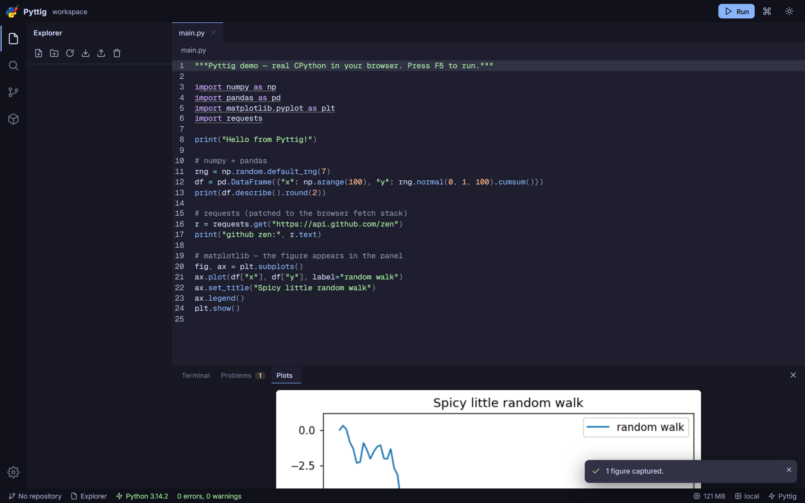

# 🌶️ Pyttig — pittig fast Python, fully in your browser

Pyttig (*pittig* — Dutch for "spicy") is a Python-first, VS Code-like IDE that
runs **entirely in your browser**. Real CPython 3.14, real packages
(`requests`, `pandas`, `matplotlib`, …), real language intelligence, real git —
nothing leaves your machine, nothing to install.



## Run it (no install)

**Option A — zero install (Python 3.9+ only, you already have it for Python work):**

```bash
python pyttig.py
```

This serves the app at http://localhost:8765, opens your browser, and additionally
provides:

- **cross-origin isolation headers** → one-key stop (`Shift+F5`), interactive
  `input()` in the terminal, streaming `requests`
- **a local git CORS proxy** (`/__pyttig__/proxy/`) → clone / pull / push from
  GitHub with no third-party proxy involved

**Option B — any static server** (reduced runtime features, documented below):

```bash
npx serve dist   # or: python -m http.server -d dist
```

**Option C — host it** (Vercel, Netlify, GitHub Pages, …): see
[Deploying](#deploying) below.

## Deploying

The app is fully static (`dist/`), so it hosts anywhere. Two headers and one
optional function make the hosted version as capable as the launcher:

**Vercel** — import the repo as-is: `vercel.json` already runs the build
(`npm run build`), serves `dist/`, sets the cross-origin isolation headers, and
publishes a **serverless git proxy** at `/api/proxy` so clone/pull/fetch work
without any third-party proxy:

| Concern | How it's handled |
| --- | --- |
| `Cross-Origin-Opener-Policy: same-origin` + `Cross-Origin-Embedder-Policy: require-corp` | set for all routes in `vercel.json` → SharedArrayBuffer works (stop button, interactive `input()`, streaming `requests`) |
| Git remotes (CORS) | `/api/proxy` function, auto-detected by the app; SSRF-guarded; streams responses |
| Pyodide + wheels | jsDelivr CDN (sends `Cross-Origin-Resource-Policy: cross-origin`, works under COEP) |
| Caching | hashed `/assets/*` and `/fileicons/*` are immutable |

Notes for hosted mode:

- Vercel functions cap request bodies at ~4.5 MB, so **very large pushes** may
  need the launcher (`python pyttig.py`) or a Cloudflare Worker proxy — clone,
  pull and fetch are unaffected.
- Deploying on a different host? Copy the header block from `vercel.json`
  (COOP/COEP on every route) and either add the same proxy function or leave
  Settings → Git → CORS proxy on `auto` (falls back to
  `cors.isomorphic-git.org`).

**Try the hosted shape locally** (static dist + headers + `/api/proxy`, same as
Vercel):

```bash
npm run sim:vercel        # http://127.0.0.1:8902
npm run test:proxy        # the proxy's checks: CORS, SSRF blocks, errors
```

## For classrooms (Chromebooks, shared devices)

Pyttig fits the "clone the exercises, then run them" workflow on machines
where you cannot install anything — including ChromeOS:

1. **Teacher:** deploy once (see [Deploying](#deploying)) and hand out the URL.
2. **Student:** *Clone a GitHub repo* on the start screen → paste the repo URL.
   You land in the Explorer with the repo revealed and its files ready to open.
   If the repo ships a `requirements.txt`, Pyttig offers to install the
   dependencies; imports are also installed automatically on first run.
3. **Run:** `Ctrl+Enter` (or the Run button). Output appears in the terminal;
   matplotlib figures land in the Plots panel.

Chromebook-specific notes:

- **No function keys** — `Ctrl+Enter` runs, `Ctrl+Click` goes to definition,
  `Ctrl+Shift+P` opens everything, and the Run button is clickable.
- Exercise repos update with **Pull** (one button in Source Control); there is
  deliberately no commit/push UI — for handing work in, right-click →
  *Download*, or *Download Workspace (.zip)* in the explorer.
- Files live in the browser (OPFS) per profile/browser. Work survives
  refreshes and restarts; clearing site data (or incognito) removes it.
- **Low-RAM devices (4 GB):** the data-science preload is off by default and
  packages install only when code imports them; the Python runtime also
  unloads itself when idle. Keep other tabs closed.
- First run needs the network once (Pyodide from jsDelivr, packages from the
  Pyodide index/PyPI). If your school network blocks that, self-host with the
  launcher (`--download-pyodide`) or keep one warm tab.

## Features

**Editor (VS Code feel, CodeMirror 6 core — ~160 KB, not ~5 MB)**

- Two-button start screen: new file, or clone a GitHub repo
- Tabs, breadcrumbs, command palette (`Ctrl+Shift+P`), quick open (`Ctrl+P`),
  workspace search + replace, symbol picker (`Ctrl+Shift+O`), go to line
- Material Icon Theme file/folder icons (VS Code's icon set)
- Custom right-click menus: explorer (open, new, rename, delete, download, copy
  path) and editor (undo/redo, cut/copy/paste, go to definition, references,
  rename, format, palette) — fully keyboard-navigable
- Catppuccin themes: Mocha (dark), Latte (light), or follow the system
- VS Code keymap: `F5` run, `F2` rename, `F12` go to definition, `Shift+F12`
  references, `Shift+Alt+F` format, `Ctrl+B`/`Ctrl+`` toggles, …

**Full LSP (in-process language server, real LSP protocol)**

- Completions (incl. `os.` dot completion), hover docs, signature help,
  go-to-definition, find references, rename — powered by **Jedi** in Pyodide
- Diagnostics + formatting by **Ruff (WASM)**, Problems panel, quick fixes
  (e.g. remove unused imports), organize-imports via fixes, format-on-save

**Python runner (Pyodide = CPython 3.14 in a Web Worker)**

- `F5` runs the file, `F9` runs selection, `# %%` cells work; stop, restart,
  persistent console namespace optional
- xterm.js terminal with ANSI colors, clickable tracebacks, `input()` support
- **Packages**: `!pip install <pkg>` lines work in your code (Colab muscle
  memory), missing imports offer a one-click install, `requirements.txt` is
  one click, and the Packages view has presets. Installs are remembered and
  quietly restored on your next visit. Under the hood this is
  [micropip](https://micropip.pyodide.org/): pure-Python wheels from PyPI plus
  the packages prebuilt for Pyodide — there is no real pip in a browser (no
  subprocesses, no compilers), so C-extension packages without a wasm build
  can't be installed. `npm run check:libs` verifies the popular-library
  matrix against the built app.
- Packages panel: data-science / web / dev one-click stacks, install, uninstall
- `matplotlib` figures captured into a Plots panel; program file writes sync back
- `requests`/`urllib` work (patched to the browser stack); `await pyfetch(...)` too

**Git, deliberately minimal (isomorphic-git in a worker, OPFS on-disk format)**

- **Clone, pull, fetch, switch branch** — that is the whole surface. No commit
  screen, no staging, no history, no author/email forms
- Works with GitHub via the launcher proxy (or a public/custom proxy);
  token auth for private repos (session-only by default)
- Merge conflicts land as conflict markers you resolve in the editor

**Files** live in the Origin Private File System (private to the browser,
survives restarts): explorer, upload, download as `.zip`, import `.zip`, and a
**reset button** that wipes the workspace back to a clean slate. Fresh installs
start empty — no sample files; your workspace only contains what you create or
clone.

## Packages: what works?

Everything in the [Pyodide built-in set](https://pyodide.org/en/stable/usage/packages-in-pyodide.html)
(numpy, pandas, scipy, scikit-learn, matplotlib, requests, httpx, Pillow,
beautifulsoup4, lxml, pydantic, sqlalchemy, fastapi, openpyxl, sympy, …), plus
**any pure-Python wheel from PyPI** via micropip, plus **pure-Python source
packages** (sdist-only projects are built in-process — no compiler involved)
with their dependencies resolved against the Pyodide set as well.

Verified with `npm run check:libs`, which installs and imports the PyPI
download top 100 plus ~160 commonly used libraries against the built app:
**193 of 218 import cleanly, and every failure is a documented browser
limitation** — compiled C/C++/Rust extensions with no wasm build (torch,
tensorflow, grpcio, greenlet, psycopg2, spacy, catboost, keras, litellm),
desktop toolkits (tkinter, turtle, PyQt, wxPython, Kivy), OS/process APIs
(psutil, playwright, scrapy's reactor) and host build tooling (pip, tox,
pre-commit). The top-100 downloads list alone: 95/100 (4 impossible, plus
`soupsieve` 2.8.x, which imports `bs4` without declaring it — use
`beautifulsoup4`).

Not possible in a browser at all: raw sockets, subprocesses, servers,
compilers, and C extensions without a wasm build. When a package hits one of
those limits the app says which one, instead of failing silently.

### CodeFever python series (P1/P2/P3 + Maistros)

Every library the lesson repos actually import works in Pyttig:

| Lesson | Library | Status |
| --- | --- | --- |
| P1 L9/L10 | pygame | works (`pygame-ce` is installed under the name `pygame`) |
| P2 L2/L5 | requests, Pillow | works |
| P2 L4 | fastapi | works; no server sockets, so test routes with `httpx.ASGITransport` and `async def` endpoints |
| P2 L5 | numpy | works |
| P2 L8 | discord.py | works (imports; a real bot needs a gateway connection) |
| P2 L9/L10 | pygame | works |
| P3 L1/L4/L5 | requests, beautifulsoup4 | works |
| P3 L6/L7 | flask | works; use `app.test_client()` instead of `app.run()` |
| P3 L8 | matplotlib, huggingface_hub | works |
| P3 L9/L10 | pygame | works |
| Maistros 1/2 | numpy, scikit-learn, matplotlib, pandas, scipy, gymnasium, datasets, openai, langdetect, imbalanced-learn | works |

Not possible, with the reason:

- **transformers** (P3 L7/L8) and **ultralytics** (P3 L8) need a torch/tf
  backend and `tokenizers` (Rust, no wasm build).
- **supervision** (P3 L8) depends on `pybboxes`, whose build compiles Cython.
- Declared in `pyproject.toml` but never imported by the lesson code, so they
  don't matter: `dearpygui` (P1 L9/L10), `pikepdf`, `pyautogui`, `python-xlib`
  (P2 L3). The Maistros `requirements.txt` files are Colab freezes that also
  list `jax`, `faiss-cpu`, `coqui-tts` and `face_recognition_models` — none of
  which the notebooks import. Installing a `requirements.txt` now skips the
  notebook/Jupyter plumbing automatically and reports how many it skipped.
- P3 L7/L8 lessons are `.ipynb` notebooks; Pyttig edits `.py` files, so the
  notebook lessons stay in Colab/Jupyter.
- `pygame` is aliased to `pygame-ce` (the wasm build), and other module names
  are mapped too: `PIL`→`pillow`, `bs4`→`beautifulsoup4`,
  `sklearn`→`scikit-learn`, `cv2`→`opencv-python`, `discord`→`discord.py`,
  `yaml`→`pyyaml`, `docx`→`python-docx`, and more.

A **CodeFever P1–P3** stack in the Packages view installs the whole working set
in one click.

## Memory design

- Shell + editor stay light; Pyodide (~100–300 MB with data stack), Ruff WASM
  and git load **lazily, in workers**, never on the UI thread
- One shared Pyodide instance for running + Jedi; idle auto-unload frees it
  (configurable, plus a manual restart); status bar always shows runtime state

## Project layout

```
pyttig.py            # stdlib-only launcher: serve + headers + git proxy
index.html  src/     # Vite + TypeScript app (no framework, no Monaco)
  app/      shell, palette, keymap, settings, themes, toasts, dialogs
  editor/   tabs, CodeMirror, search, outline
  fs/       OPFS workspace, zip import/export
  runtime/  Pyodide worker client, xterm terminal, packages, plots
  lsp/      Jedi server (runs in Pyodide), Ruff WASM worker, LSP bridge,
            Problems panel
  git/      isomorphic-git worker (+OPFS fs adapter), client, Source Control UI
tests/      vitest units + Playwright e2e (boot→run→lint→complete→git, clone→pull)
dist/        prebuilt app — end users need nothing but a browser (+launcher)
```

## Develop

```bash
npm install
npm run dev        # http://localhost:5173 (already cross-origin isolated)
npm run typecheck
npm test           # vitest units
npx playwright test          # e2e (installs chromium once)
npm run build      # → dist/
```

## Offline use

After first load the browser caches the app; Pyodide + packages come from CDN.
Fully offline: `python pyttig.py --download-pyodide 314.0.7`, then
`python pyttig.py --pyodide-dir .pyttig/pyodide` and set the Pyodide URL in
Settings → Runtime to `http://localhost:8765/__pyttig__/pyodide/314.0.7/`.

## Limitations (honest)

- No raw sockets / subprocess / local servers from Python (browser sandbox)
- No Git LFS / submodules; large repos: use shallow clones
- `input()` is interactive only with the launcher (otherwise it reads from an empty stdin)
- Without the launcher, hard-stop of tight loops restarts the runtime instead

## License & credits

MIT. Built on excellent open source: CodeMirror 6 (+ `@codemirror/lsp-client`),
Pyodide (MPL-2.0), Ruff (MIT), Jedi, isomorphic-git, xterm.js, fflate,
Catppuccin (themes), Material Icon Theme (file icons), Geist Mono & Inter (fonts).
See `package.json` for the full list.
